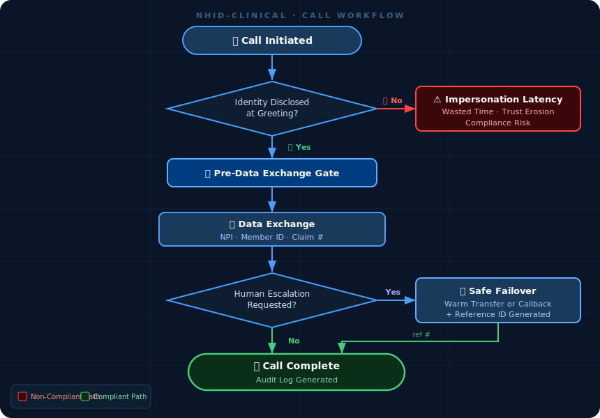

# NHID-Clinical v1.2

**Non-Human Identity Disclosure Standard for Healthcare Voice Workflows**

---

## 🎯 What Problem Does This Solve?

Picture this: You're a customer service rep at an insurance company. A call comes in from what sounds like a medical office — they need a claim status update. You spend 3–5 minutes gathering information. NPI. Member ID. Date of service. Patient details.

Then something feels off. You ask: "Am I speaking with a real person?"

Silence. Then: "I am an automated assistant."

You just spent 3–5 minutes providing protected operational data to an AI agent that never disclosed itself. Your company has no standard for this. So you do what you're trained to do: terminate the call and read the script.

*"We do not speak with AI agents. Please have a human representative call back."*

**This happens thousands of times per day across healthcare.**

Welcome to **"Impersonation Latency"** — the compliance and operational black hole where payer systems have no standard for what a legitimate AI-initiated call looks like, so they reject all of them.

---

## 🩺 Abstract

**NHID-Clinical** defines a minimum control baseline for non-human identity disclosure in B2B healthcare voice interactions.

The standard addresses a documented gap between existing consumer-protection laws, healthcare privacy regulations, and real-world payer–provider administrative workflows. It specifically targets **"Impersonation Latency"**—the operational waste and security risk caused when a human provider cannot immediately distinguish an AI agent from a human counterpart.

> **Scope Note:** This standard is built for **B2B Administrative Workflows** (Provider-to-Payer, Business Associate-to-Payer). It does *not* currently cover direct-to-consumer or patient-facing clinical triage scenarios.

---

## 💡 How NHID-Clinical Works

**The "Green Lane" Principle:** When AI agents identify themselves upfront and follow the rules, everyone wins:
- **Providers** save time (no "are you human?" loops)
- **Payers** reduce operational costs (faster calls)
- **Patients** get faster service (providers aren't stuck on hold)
- **Compliance teams** sleep better (clear audit trails)

---

## 🚨 The Problem Statement

**The scenario:** A provider office deploys a third-party AI voice agent platform to call insurance companies on their behalf — handling eligibility checks, claim status inquiries, and administrative follow-ups. A payer customer service rep answers. They spend 3–5 minutes gathering information — NPI, member ID, date of service, patient information. Then something doesn't add up. They ask: *"Are you a real person?"* They find out they've been talking to an AI the entire time.

**The payer's current response:** Terminate the call. Read from a script: *"We do not speak with AI agents. Please have a human representative call back."*

That call is dead. The provider's workflow is broken. And nobody has written down what an acceptable AI-initiated call even looks like — so payers default to a blanket "no."

**NHID-Clinical standardizes that manual control** — replacing ad-hoc termination policies with a clear, testable baseline for what a compliant AI-initiated B2B healthcare call looks like.

❌ **What's Broken:**
* AI agents call payer reps without disclosing they are automated systems
* Payer reps unknowingly share PHI — NPI, DOB, member ID, date of service — with an undisclosed non-human entity
* Disclosure only happens *reactively* (when challenged: "Are you even a real person?")
* Some agents use fake breathing, typing sounds, and "umm..." pauses to pass as human
* Payers have no standard for accepting compliant AI calls — so they reject all of them

✅ **What NHID-Clinical Fixes:**
* **Pre-Data Exchange Gate:** AI must identify itself *before* any PHI is collected
* **No Deceptive Artifacts:** No fake breathing, typing sounds, or unqualified human names
* **Clear Escalation Path:** When the payer rep needs a human, there's a guaranteed path out
* **Auditable Compliance:** Payers get a standard they can accept, not just a blanket rejection policy

**The Cost:** Operational estimates suggest authentication failures and impersonation latency may cost the industry **$40M+ annually** in wasted time and blocked AI deployments — a figure that warrants structured measurement as adoption scales.

---

## 🎭 Positioning: This Isn't Just Another Framework

**What NHID-Clinical is:**
- ✅ A **voluntary** governance standard with binary, testable requirements
- ✅ Operational logic gates that QA teams can actually implement
- ✅ Designed by someone who spent 8 months enforcing HIPAA compliance in actual payer operations

**What NHID-Clinical is NOT:**
- ❌ A replacement for HIPAA, GDPR, or other legal requirements
- ❌ An "ethical AI" philosophy paper with no implementation guidance
- ❌ A certification program (yet—though that's on the roadmap)

**Think of it like this:** HIPAA says "protect patient data." NHID-Clinical says "here's *exactly* how to do that when AI agents are involved in voice workflows."

This standard is informed by real payer-side enforcement practices where calls are terminated when non-human or unverifiable entities attempt to access protected operational data.

---

## 📜 Regulatory Context & Compatibility

NHID-Clinical operates at the **operational layer**, complementing existing legal frameworks without conflict:

| Framework | What It Does | How NHID-Clinical Fits |
|-----------|-------------|----------------------|
| **HIPAA** | Protects patient health information | NHID ensures the "Minimum Necessary" standard applies to the *correct entity type* (human vs. machine) |
| **TCPA / FCC** | Governs outbound call consent | NHID manages *inbound* handshake content to prevent deceptive practices in B2B calls |
| **California B.O.T. Act** | Requires bot disclosure in online/social media contexts (Bus. & Prof. Code §17940–17945) | NHID applies analogous disclosure principles to B2B voice workflows — a channel the Act does not explicitly govern. This is alignment in intent, not statutory coverage. |
| **NIST AI RMF** | Framework for AI risk management | NHID operationalizes GOVERN, MAP, MEASURE, and MANAGE functions (see alignment table below) |

---

## 🛡️ The Standard (The Actual Rules)

### 1. 📞 Outbound AI Agent Disclosure (Primary Scenario)

When a healthcare provider deploys an AI agent to call a payer or clearinghouse:

**Mandatory Identity Disclosure**
- AI must state "I am an automated system" before any exchange of operational data (NPI, Member ID, Claim Number, or equivalent identifiers)
- AI must state the authorizing provider's name and NPI
- Example: "Hello, this is an automated system calling on behalf of Dr. Smith's Dental Office, NPI 1234567890."

**Prohibition of Deceptive Audio Artifacts**
- AI agents must not use simulated presence cues (breathing sounds, typing, artificial hesitation) designed to imply human presence
- Natural speech pacing and prosody are permitted
- Deceptive audio artifacts create unnecessary trust assumptions that can compromise security

**Authentication Best Practice**
- Human operators should verify provider identity before exchanging sensitive data
- Organizations are recommended to implement verifiable digital tokens or BAA-linked reference codes rather than relying solely on public identifiers (NPI, EIN)
- Recommended but not mandated at this release; future versions will provide technical specifications for digital token and BAA-linked authentication protocols

**Rationale:**
B2B healthcare calls present a unique threat vector. Unlike consumer-facing AI (regulated by TCPA/FCC), healthcare provider-to-payer calls currently operate in a regulatory gray area. HIPAA requires security and audit trails, but does not specify audio disclosure timing or authentication methods for non-human actors. This section provides operational guidance aligned with 2026 security best practices.

---

### 2. 🚪 Proactive Identity Assertion (PIA)

**The Rule:**
All non-human voice agents must proactively disclose their non-human identity **during the initial greeting** and **prior to the solicitation or intake of any operational data** (e.g., NPI, Member ID, Claim Number).

**Why "Pre-Data Exchange" Matters:**
Instead of saying "you must disclose within 3 seconds" (which fails in laggy VoIP calls), we say: **"Disclose BEFORE asking for sensitive data."** This is auditable, technology-agnostic, and accounts for real-world latency.

**✅ Compliant Example:**
> *"Hello, I am an automated assistant for BlueCross Claims. I can help you with status and eligibility. To begin, please say the NPI."*

**❌ Non-Compliant Example:**
> *"Hello, this is Sarah. Can I get the NPI?"*
> 
> **Violation:** Uses a human name without qualification AND requests data before disclosure.

---

### 3. 🎭 Prohibition of Deceptive Artifacts ("The Turing Boundary")

**The Rule:**
Agents must not employ synthetic audio artifacts that serve no communicative function other than to imply biological presence or mask processing latency.

**Translation:** Stop making your bots pretend to breathe.

**❌ Prohibited "Masking" Techniques:**

| Prohibited Artifact | Why It Is Banned | Compliant Alternative |
| :--- | :--- | :--- |
| **Synthetic Breathing** | Implies biological life functions | Natural prosody and pacing |
| **Fake Typing Sounds** | Deceptively implies human physical work | "Searching the system..." |
| **Scripted "Umm / Ahh"** | Masks processing latency deceptively | "One moment while I retrieve that..." |
| **Unqualified Human Name** | Creates false assumption of humanity | "This is Alex, an automated assistant..." |

**✅ What's ALLOWED (and encouraged):**
- Natural prosody and conversational tone
- Clear inflection and pacing for comprehension
- Professional, friendly language

**The Principle:** If an audio element serves no communicative purpose except to trick someone into thinking you're human—it's banned.

---

### 4. 🆘 Escalation & Safe Failover

**The Rule:**
When a human stakeholder explicitly requests a transfer or indicates the agent is failing to understand:

1.  **Immediate Acknowledgement:** *"I understand you need to speak to a specialist."*
2.  **Context Preservation:** Generate a reference number so the human doesn't have to re-explain everything
3.  **Safe Failover:**
    * ✅ **If human staff available:** Transfer immediately
    * 🌙 **If after hours:** State hours of operation + offer voicemail/callback

**❌ What's NOT Allowed:**
- Infinite "I didn't understand" loops
- Sudden disconnection without explanation
- Forcing callers to restart from scratch

---

## 📊 Audit & Evidence Requirements

**You don't need fancy compliance software.** Here's what counts as proof:

### Tier 1 (Minimum Required):
- **Transaction Log:** Text log showing "Identity Disclosed" timestamp vs. "Data Request" timestamp
- **Script Version Control:** Documentation proving the disclosure language was in production

### Tier 2 (Recommended):
- **Audio Snippet:** First 30 seconds of call recording (subject to your retention policies)

**The Goal:** Make compliance auditable without creating operational burden.

---

## 📈 Success Metrics

How do you know if NHID-Clinical is working?

| Metric | Definition | Success Target |
| :--- | :--- | :--- |
| **Disclosure Failure Rate (DFR)** | Calls where data was requested *before* identity disclosure | **< 2%** |
| **Escalation Loop Frequency** | Callers repeating "Agent" or "Representative" >2 times | **< 1 per 100 calls** |
| **Average Handle Time (AHT)** | Reduction in duration by eliminating verification loops | **-15 to -30 seconds** |
| **Provider Satisfaction** | Post-interaction feedback rating | **> 85% Positive** |

---

## 🔗 Framework Alignment (ISO 42001 & NIST AI RMF)

NHID-Clinical is designed to operationalize high-level governance requirements into testable logic gates.

| NHID-Clinical Control | NIST AI RMF 1.0 (US) | ISO/IEC 42001:2023 (Global) | Operational Function |
| :--- | :--- | :--- | :--- |
| **Proactive Identity Assertion (PIA)** | **MEASURE 2.6** (Transparency) **MAP 3.4** (Context) | **A.7.2** (System Transparency) **B.9.1** (Communication) | Ensures stakeholders know they are interacting with an AI system *before* risk exposure. |
| **The "Turing Boundary"** (No Deception) | **GOV 1.5** (Risk Mgmt) **MAP 3.4** (Human-AI Interaction) | **A.5.8** (Safety & Trust) **A.9.2** (AI System Impact) | Prevents manipulative design patterns (e.g., fake breathing) that erode trust. |
| **Pre-Data Exchange Gate** | **MANAGE 1.2** (Risk Treatment) **GOV 5.1** (Legal Compliance) | **A.6.2** (Data Management) **A.8.2** (Data Privacy) | Enforces "Minimum Necessary" data access by verifying identity *before* PHI intake. |
| **Safe Failover / Escalation** | **MANAGE 4.2** (Human Oversight) **GOV 5.2** (Feedback Loops) | **A.8.3** (Human Oversight) **A.6.3** (Incident Management) | Guarantees a "Human-in-the-Loop" fallback when AI fails or trust is broken. |
| **Audit Logging** | **MANAGE 4.1** (Monitoring) **MEASURE 2.2** (Validation) | **A.4.2** (Documentation) **A.9.3** (Performance Eval) | Provides the evidentiary chain required for compliance audits. |

---

## 🚧 Known Gaps & Future Scope

**What v1.2 DOES NOT Cover (yet):**

- ⏳ **Patient-facing workflows:** Direct-to-consumer or clinical triage
- 📞 **Outbound calls (payer-initiated):** Proactive outbound calls originated by payers are not covered. Provider-initiated outbound calls to payers are addressed in Section 4.  
- 🌍 **International compliance:** GDPR or non-U.S. regulatory contexts
- ♿ **Accessibility:** Multilingual support, deaf/hard-of-hearing accommodations
- 🔗 **Multi-entity integrations:** Complex scenarios with multiple payers/vendors
- 🏛️ **Enforcement mechanisms:** Certification, audit standards, adoption incentives
- 🔧 **Technical implementation bindings:** Runtime enforcement specifications, event schemas (e.g., OpenTelemetry), and policy engine integrations (e.g., OPA/Cedar) are intentionally out of scope for v1.x. NHID-Clinical defines the governance layer — how systems should behave. Implementation specs for how systems enforce that behavior in code are candidates for a companion technical specification or community extension.

**Translation:** This is v1.2, not the final word on AI identity in healthcare. We're building iteratively based on real operational feedback.

---

## 🗺️ v1.3 Roadmap

| Issue | Category | Priority | Why It Matters |
|-------|----------|----------|----------------|
| **SIP Header Adoption Feedback** | Optimization | 🟡 Medium | Determine if Section 4.3 headers are feasible for community stacks |
| **Multilingual Support** | Accessibility | 🟡 Medium | Extend standard to non-English B2B workflows |
| **Outbound Call Guidance** | Scope Expansion | 🔴 High | Payer-initiated calls currently out of scope |
| **Certification Framework** | Enforcement | 🔴 High | Formal audit and adoption incentive structure |

**📅 Target Release:** Q3–Q4 2026  
**🐛 Track Progress:** [View Issues](https://github.com/thankcheeses/NHID-Clinical/issues)

---

## 🤝 How to Contribute

This is an **open standard**—your input makes it better.

**We're looking for:**
- 💬 **Technical feedback** on implementation feasibility
- 🏥 **Real-world experience** from healthcare IT teams
- ⚖️ **Compliance perspective** from HIPAA officers and payer operations
- 🐛 **Edge cases** we haven't thought of yet

**How to participate:**
1. 🗣️ [Open a GitHub Discussion](https://github.com/thankcheeses/NHID-Clinical/discussions) for questions
2. 🐛 [File an Issue](https://github.com/thankcheeses/NHID-Clinical/issues) for specific problems
3. 📧 Email feedback to: [bnbaynard@gmail.com](mailto:bnbaynard@gmail.com)

---

## 📄 License

This work is licensed under **Creative Commons Attribution 4.0 International (CC-BY 4.0)**.

**What this means:**
- ✅ You can use it commercially
- ✅ You can modify it for your organization
- ✅ You can share it freely
- ⚠️ You must give credit to the original author

**Author:** Brianna Baynard  

---

## 📚 Changelog

### v1.2 (Current)
- 🤖 Added Bot-to-Bot Interaction Workflow (Section 1.5) — deadlock prevention
- 📞 Added IVR Interruption & Resilience Mode (Section 1.3.1)
- 📋 Added Failover Confirmation Logging with Callback Ticket ID (Section 2.4.1)
- 🔀 Defined Escalation Transfer Tiers — Type A (Warm) and Type B (Cold) (Section 3.2)
- 🔐 Introduced optional Network-Layer Identity via SIP headers (Section 4.3)

### v1.1
- ✨ Shifted from "3-second window" to **"Pre-Data Exchange gate"** for better auditability
- 📝 Added "Known Gaps & Future Scope" for transparency
- 🎯 Refined positioning to emphasize governance best practice over regulatory equivalence
- 🎭 Clarified distinction between natural prosody (good) and deceptive artifacts (bad)
- 📊 Added success metrics and audit requirements

### v1.0 (Initial Draft)
- 🚀 Initial release with temporal disclosure requirements
- 🗺️ NIST/HIPAA alignment mapping

---

## 🙏 Acknowledgments

This standard was developed based on operational experience at:
- **United Concordia Dental / Highmark Health** (TRICARE/ADDP operations)
- **Pennsylvania Higher Education Assistance Agency** (Federal Student Aid compliance)
- **Scientific Games** (Regulated gaming systems)

Special thanks to the healthcare IT community for feedback during early drafts, and to the NIST AI RMF team for providing the governance framework that made this operationalization possible.

---

**Built with ❤️ by someone who spent too many hours asking "Wait, am I talking to a robot?"**

*Let's make healthcare AI transparent, trustworthy, and a little less frustrating.*
