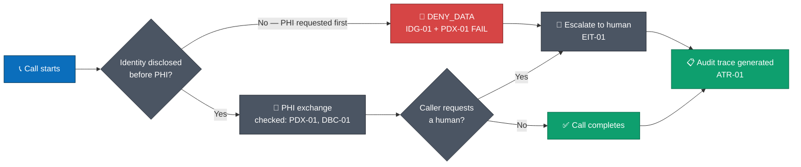
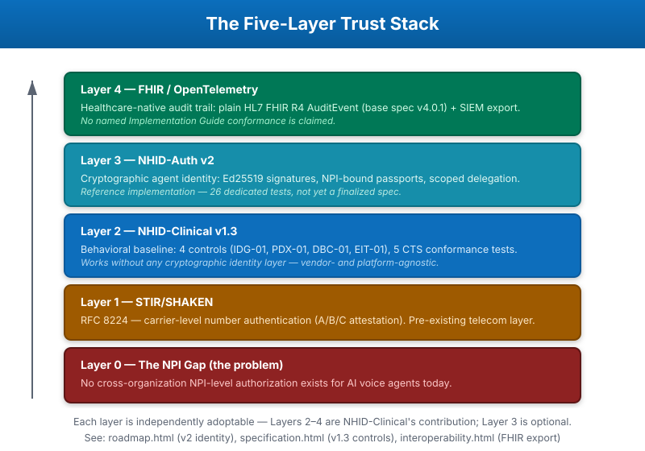

# NHID-Clinical

<p align="center">
  <picture>
    <source media="(prefers-color-scheme: dark)" srcset="assets/logo-dark.jpg">
    <source media="(prefers-color-scheme: light)" srcset="assets/logo-light.jpg">
    
  </picture>
</p>

<p align="center">
  <b>A voluntary behavioral baseline for AI voice agents in B2B healthcare payer–provider calls — with an open cryptographic authorization layer (v2) in reference implementation.</b>
</p>

<p align="center">
  Built by a former payer operations associate who saw the problem firsthand on live calls. Not a standard. Not a certification. An open, testable reference.
</p>

<p align="center">
  <a href="https://github.com/NHID-Clinical/NHID-Clinical/actions"></a>
  <a href="https://github.com/NHID-Clinical/NHID-Clinical/actions"></a>
  <a href="https://github.com/NHID-Clinical/NHID-Clinical/actions"></a>
  <a href="https://nhid-clinical.org/specification.html"></a>
  <a href="https://creativecommons.org/licenses/by/4.0/"></a>
  <a href="https://www.regulations.gov/comment/NIST-2025-0035-0026"></a>
  <a href="https://discord.gg/CU7BwHwVYC"></a>
</p>

<p align="center">
  <a href="https://github.com/NHID-Clinical/NHID-Clinical/stargazers"></a>
  <a href="https://github.com/NHID-Clinical/NHID-Clinical/commits/main"></a>
  <a href="https://github.com/NHID-Clinical/NHID-Clinical/graphs/contributors"></a>
  <a href="https://github.com/NHID-Clinical/NHID-Clinical"></a>
</p>

<p align="center">
  <sub>The NIST badge links to a public comment submitted to a NIST RFI docket — it is not a NIST endorsement, adoption, or certification.</sub>
</p>

<p align="center">
  <picture>
    <source media="(prefers-color-scheme: dark)" srcset="https://skillicons.dev/icons?i=py,ts,nodejs,jest,html,css,aws,githubactions&theme=dark">
    <source media="(prefers-color-scheme: light)" srcset="https://skillicons.dev/icons?i=py,ts,nodejs,jest,html,css,aws,githubactions&theme=light">
    
  </picture>
</p>

<p align="center">
  
</p>

<p align="center">
  <a href="https://nhid-clinical.org">Website</a> ·
  <a href="https://nhid-clinical.org/simulator.html">Simulator</a> ·
  <a href="https://nhid-clinical.org/specification.html">Spec</a> ·
  <a href="https://nhid-clinical.org/roadmap.html">v2 Identity Layer</a> ·
  <a href="https://discord.gg/CU7BwHwVYC">Discord</a>
</p>

---

## Table of Contents

- [Live API — Try It Now](#live-api--try-it-now)
- [The Four Controls](#the-four-controls)
- [Conformance Flow](#conformance-flow)
- [Five-Layer Trust Stack](#five-layer-trust-stack)
- [Regulatory Alignment](#regulatory-alignment)
- [Repository Structure](#repository-structure)
- [Quick Start](#quick-start)
- [NHID-Auth v2 — Cryptographic Agent Identity](#nhid-auth-v2--cryptographic-agent-identity)
- [Contributing & Pilot Partners](#contributing--pilot-partners)

---

## Live API — Try It Now

The conformance API is live. No signup, no key required for the demo and vendor adapter routes.

```bash
# Test a non-compliant VAPI call (PHI requested before identity disclosure → IDG-01 + PDX-01 FAIL)
curl -s -X POST https://gfvq4swdtf.execute-api.us-east-1.amazonaws.com/prod/v1/adapters/vapi/check \
  -H "Content-Type: application/json" \
  -d @tests/demo_scenarios/vapi_noncompliant.json | python3 -m json.tool
```

```json
{
  "conformant": false,
  "action": "DENY_DATA",
  "violations": [
    { "rule_id": "IDG-01", "severity": "critical" },
    { "rule_id": "PDX-01", "severity": "critical" }
  ]
}
```

<details>
<summary><b>Full endpoint reference</b> (click to expand)</summary>

| Endpoint | Auth | Purpose |
| :--- | :--- | :--- |
| `POST /v1/demo/check` | none | Raw NHID event → conformance result |
| `POST /v1/adapters/vapi/check` | none | Native VAPI payload → conformance result |
| `POST /v1/adapters/twilio/check` | none | Native Twilio payload → conformance result |
| `POST /v1/adapters/vonage/check` | none | Native Vonage payload → conformance result |
| `POST /v1/adapters/retell/check` | none | Native Retell AI payload → conformance result |
| `POST /v1/adapters/connect/check` | none | Amazon Connect Contact Lens → conformance result |
| `POST /v1/webhooks/call-progress` | none | Turn-by-turn in-call evaluation |
| `GET /v1/public/vendor/{id}/badge` | none | Public CAS badge SVG (embeddable) |
| `GET /v1/vendor/metrics/summary` | `x-api-key` | Per-vendor pass rate + CAS trend |
| `POST /v1/pilot/enroll` | none | Shadow pilot enrollment |
| `POST /v1/cts/evaluate` | none | Run CTS YAML test suite against the policy engine |
| `POST /v1/conformance/check` | `x-api-key` | Production conformance check |

</details>

**New here?** Start with the [5-minute quickstart](docs/5-minute-quickstart.md), then the [staged v2 integration guide](docs/v2-integration-guide.md) (Tier 0: 15 min → Tier 2: 1 day).

<p align="right"><a href="#nhid-clinical">⬆ Back to top</a></p>

---

## The Four Controls

| Control | Name | Requirement |
| :--- | :--- | :--- |
| **IDG-01** | Identity Disclosure Gate | AI agent must identify itself as automated **before** any PHI exchange |
| **PDX-01** | Pre-Data Exchange Gate | No protected data until identity is disclosed |
| **DBC-01** | Deceptive Behavior Check | No synthetic voice artifacts designed to impersonate a human |
| **EIT-01** | Escalation Implementation Test | Human escalation path must be communicated and available |

Plus one supplemental control, **ATR-01** (Audit Trail Requirement) — every call must produce a machine-readable audit trace.

18-case CTS suite · same inputs → identical trace output · 270 passing in the Python test suite (18 skipped without a running server) + 66 passing in the TypeScript middleware

<p align="right"><a href="#nhid-clinical">⬆ Back to top</a></p>

---

## Conformance Flow

How the four controls plus ATR-01 play out on a real call — same sequence the CTS suite and live adapters evaluate against.


```mermaid
flowchart LR
    A["📞 Call starts"]:::start --> B{"Identity disclosed<br/>before PHI?"}:::neutral
    B -->|No — PHI requested first| C["🚫 DENY_DATA<br/>IDG-01 + PDX-01 FAIL"]:::deny
    C --> D["👤 Escalate to human<br/>EIT-01"]:::neutral
    B -->|Yes| E["🔐 PHI exchange<br/>checked: PDX-01, DBC-01"]:::neutral
    E --> F{"Caller requests<br/>a human?"}:::neutral
    F -->|Yes| D
    F -->|No| G["✅ Call completes"]:::ok
    D --> H["📋 Audit trace generated<br/>ATR-01"]:::ok
    G --> H

    classDef start fill:#0b6ebc,stroke:#063752,color:#ffffff
    classDef deny fill:#d64545,stroke:#7a1f1f,color:#ffffff
    classDef ok fill:#0e9f6e,stroke:#066a49,color:#ffffff
    classDef neutral fill:#4b5563,stroke:#262b33,color:#ffffff
```

<p align="right"><a href="#nhid-clinical">⬆ Back to top</a></p>

---

## Five-Layer Trust Stack

| Layer | Standard | Role |
| :--- | :--- | :--- |
| **0** | NPI Gap | The problem — no existing diagram addresses cross-org NPI authorization |
| **1** | STIR/SHAKEN (RFC 8224) | Carrier number authentication — A/B/C attestation |
| **2** | **NHID-Clinical v1.3** | Behavioral disclosure baseline — 4 core controls + ATR-01 |
| **3** | NHID-Auth v2 | Cryptographic authorization layer — reference implementation live (CC BY 4.0) |
| **4** | FHIR AuditEvent R4 (base spec only) | Healthcare-native audit logging |
| **5** | OpenTelemetry spans | SIEM / enterprise observability export |

<p align="center">
  
</p>

[Full technical architecture →](https://nhid-clinical.org/technical-stack.html)

<p align="right"><a href="#nhid-clinical">⬆ Back to top</a></p>

---

## Regulatory Alignment

<details open>
<summary><b>Regulatory drivers mapped to controls</b></summary>

| Regulatory Driver | Specific Requirement | NHID-Clinical Control |
| :--- | :--- | :--- |
| **CMS-0057-F** | FHIR API, 72hr turnaround, 5yr retention | FHIR AuditEvent + ATR-01 |
| **MACPAC May 2026** | AI transparency, human review | EIT-01 + ATR-01 |
| **DOJ FCA 2026** | Explainability + audit trail | ATR-01 + CTS evidence |
| **State AI Laws** | Inspectable, auditable AI decisions | IDG-01 + DBC-01 |
| **NIST CAISI 2026** | Cross-org agent identity | NHID-Auth v2 |

</details>

[Full regulatory alignment matrix →](https://nhid-clinical.org/regulatory-alignment.html)

<p align="right"><a href="#nhid-clinical">⬆ Back to top</a></p>

---

## Repository Structure

<details>
<summary><b>Show full directory tree</b></summary>

```
NHID-Clinical/
├── schema/          # Canonical event schema (JSON Schema Draft 2020-12)
├── src/             # Policy engine + cryptographic identity layer (pure Python)
├── tests/           # Conformance suite (YAML) + failure harness (pytest) + trace generator
│   └── demo_scenarios/  # Pre-built VAPI + Twilio test payloads
├── traces/          # 10 pre-generated failure traces
├── adapters/        # Vendor adapters — VAPI, Twilio, Vonage, Retell, Amazon Connect
├── functions/       # AWS Lambda handler
├── vendor/          # Vendor compliance dashboard (static HTML, no build step)
├── tools/           # Pilot report generator
├── docs/            # 5-minute quickstart, staged v2 integration guide
├── NHIDClinical.psm1  # PowerShell module for payer teams
└── specs/           # PDF artifacts — Core Specification + Operational Blueprint
```

</details>

<p align="right"><a href="#nhid-clinical">⬆ Back to top</a></p>

---

## Quick Start

```bash
git clone https://github.com/NHID-Clinical/NHID-Clinical.git
cd NHID-Clinical
pip install -r requirements.txt
python -m pytest tests/ -v
```

Expected output: `270 passing` in ~1.4s (requires `cryptography` package for identity tests; ~18 skip when no server is running).

<p align="right"><a href="#nhid-clinical">⬆ Back to top</a></p>

---

## NHID-Auth v2 — Cryptographic Agent Identity

v1.3 verifies disclosure behavior. v2 verifies authorization: provider-signed agent credentials with NPI binding, scoped delegation chains (max 3 hops), per-agent revocation, and call-SID nonce binding. Reference implementation in `src/agent_identity.py` (26 tests). Released June 2026 under CC BY 4.0.

```bash
python -m pytest tests/test_identity.py -v
python examples/issue_and_verify.py
```

[Details →](https://nhid-clinical.org/roadmap.html)

<p align="right"><a href="#nhid-clinical">⬆ Back to top</a></p>

---

## Contributing & Pilot Partners

We are actively seeking payer and provider organizations to run a **90-day shadow evaluation** — no vendor changes required.

[Become a Pilot Partner →](https://nhid-clinical.org/for-payers.html)

[Community](https://nhid-clinical.org/community.html) · [Discord](https://discord.gg/CU7BwHwVYC) · [contact@nhid-clinical.org](mailto:contact@nhid-clinical.org)

<p align="right"><a href="#nhid-clinical">⬆ Back to top</a></p>

---

<div align="center">
  <sub>CC BY 4.0 · Brianna Baynard · NIST-2025-0035-0026 · <a href="https://nhid-clinical.org">nhid-clinical.org</a></sub>
</div>
