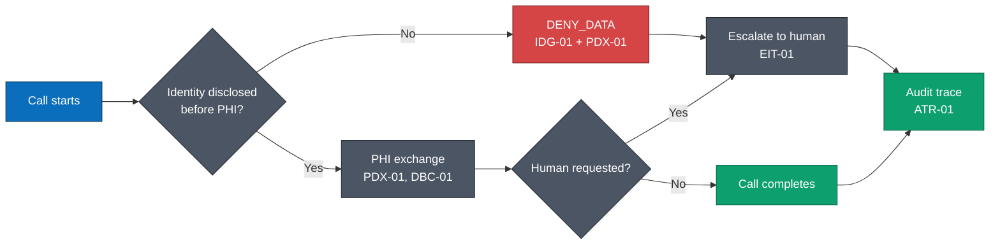

# NHID-Clinical

<p align="center">
  <picture>
    <source media="(prefers-color-scheme: dark)" srcset="assets/logo-dark.jpg">
    <source media="(prefers-color-scheme: light)" srcset="assets/logo-light.jpg">
    
  </picture>
</p>

<p align="center">
  <b>A voluntary behavioral baseline for transparent AI voice agents in B2B healthcare payer–provider calls.</b><br>
  Open reference implementation with a cryptographic authorization layer (NHID-Auth v2).
</p>

<p align="center">
  Built by a former payer operations associate who saw the <strong>impersonation latency</strong> problem firsthand on live calls.<br>
  <strong>Not a standard. Not a certification. Not a product.</strong> An open, testable reference for the ecosystem.
</p>

<p align="center">
  <a href="https://nhid-clinical.org"><strong>Website</strong></a> ·
  <a href="https://nhid-clinical.org/simulator.html">Simulator</a> ·
  <a href="https://nhid-clinical.org/specification.html">Specification</a> ·
  <a href="https://nhid-clinical.org/roadmap.html">v2 Identity</a> ·
  <a href="https://github.com/NHID-Clinical/NHID-Clinical/discussions">Discussions</a>
</p>

<p align="center">
  <a href="https://github.com/NHID-Clinical/NHID-Clinical/actions"></a>
  
  
  
  
  <a href="https://www.regulations.gov/comment/NIST-2025-0035-0026"></a>
</p>

<p align="center">
  <sub>The NIST badge links to a public comment submitted to a NIST RFI docket — not a NIST endorsement, adoption, or certification.</sub>
</p>

---

**Impersonation latency** is the core problem: the measurable trust delay when an AI voice agent operates and exchanges PHI without disclosing its non-human identity. NHID-Clinical makes that delay observable and testable with four deterministic controls, a supplemental audit-trail requirement, and a live conformance API.

<p align="center">
  <picture>
    <source srcset="assets/images/3d-renders/nexus-trust-bridge.webp" type="image/webp">
    
  </picture>
  <br>
  <sub><em>Illustrative visualization of the trust verification pathway — conceptual render for clarity, not a product diagram.</em></sub>
</p>

## The Four Core Controls (v1.3)

| Control | Name | Requirement |
| :--- | :--- | :--- |
| **IDG-01** | Identity Disclosure Gate | Disclose non-human identity **before** any PHI exchange |
| **PDX-01** | Pre-Data Exchange Gate | No protected data until identity is disclosed |
| **DBC-01** | Deceptive Behavior Check | No mimicry of human voice or behavior |
| **EIT-01** | Escalation Implementation Test | Clear human handoff path, honored on request |

Plus **ATR-01** (audit trail) — every call must produce a machine-readable trace.  
18-case CTS suite · same inputs → identical output · **330** Python tests passing (+ 66 TypeScript middleware tests)

[**Try the Governance Simulator →**](https://nhid-clinical.org/simulator.html)

## Five-Layer Trust Stack

<p align="center">
  <picture>
    <source srcset="assets/images/3d-renders/trust-stack-ziggurat.webp" type="image/webp">
    
  </picture>
</p>

| Layer | Standard | Role |
| :--- | :--- | :--- |
| **0** | NPI Gap | The problem — no cross-org NPI authorization for AI agents |
| **1** | STIR/SHAKEN (RFC 8224) | Carrier number authentication |
| **2** | **NHID-Clinical v1.3** | Behavioral disclosure baseline — 4 controls + ATR-01 |
| **3** | NHID-Auth v2 | Cryptographic authorization — reference implementation live |
| **4** | FHIR AuditEvent R4 (base spec) | Healthcare-native audit logging |
| **5** | OpenTelemetry | Enterprise observability export |

[Full technical architecture →](https://nhid-clinical.org/technical-stack.html)

## The Impersonation Latency Crisis

<p align="center">
  <picture>
    <source srcset="assets/images/3d-renders/impersonation-vs-verified.webp" type="image/webp">
    
  </picture>
  <br>
  <sub><em>Without a standard: disclosure after PHI moves, no audit trail. With v1.3: early disclosure, verification checkpoint, human escalation, sealed audit.</em></sub>
</p>

## Conformance Flow

How the controls play out on a real call — the same sequence the CTS suite and live adapters evaluate.


```mermaid
flowchart LR
    A["Call starts"]:::start --> B{"Identity disclosed<br/>before PHI?"}:::neutral
    B -->|No| C["DENY_DATA<br/>IDG-01 + PDX-01"]:::deny
    C --> D["Escalate to human<br/>EIT-01"]:::neutral
    B -->|Yes| E["PHI exchange<br/>PDX-01, DBC-01"]:::neutral
    E --> F{"Human requested?"}:::neutral
    F -->|Yes| D
    F -->|No| G["Call completes"]:::ok
    D --> H["Audit trace<br/>ATR-01"]:::ok
    G --> H

    classDef start fill:#0b6ebc,stroke:#063752,color:#ffffff
    classDef deny fill:#d64545,stroke:#7a1f1f,color:#ffffff
    classDef ok fill:#0e9f6e,stroke:#066a49,color:#ffffff
    classDef neutral fill:#4b5563,stroke:#262b33,color:#ffffff
```

## Live API — Try It Now

No signup or API key required for demo and vendor adapter routes.

```bash
curl -s -X POST https://gfvq4swdtf.execute-api.us-east-1.amazonaws.com/prod/v1/adapters/vapi/check \
  -H "Content-Type: application/json" \
  -d @tests/demo_scenarios/vapi_noncompliant.json | python -m json.tool
```

<details>
<summary><b>Full endpoint reference</b></summary>

| Endpoint | Auth | Purpose |
| :--- | :--- | :--- |
| `POST /v1/demo/check` | none | Raw NHID event → conformance result |
| `POST /v1/adapters/vapi/check` | none | Native VAPI payload → result |
| `POST /v1/adapters/twilio/check` | none | Native Twilio payload → result |
| `POST /v1/adapters/vonage/check` | none | Native Vonage payload → result |
| `POST /v1/adapters/retell/check` | none | Native Retell AI payload → result |
| `POST /v1/adapters/connect/check` | none | Amazon Connect → result |
| `POST /v1/webhooks/call-progress` | none | Turn-by-turn in-call evaluation |
| `GET /v1/public/vendor/{id}/badge` | none | Public CAS badge SVG |
| `POST /v1/cts/evaluate` | none | Run CTS YAML suite |
| `POST /v1/conformance/check` | `x-api-key` | Production conformance check |

</details>

**New here?** [5-minute quickstart](docs/5-minute-quickstart.md) · [v2 integration guide](docs/v2-integration-guide.md) (Tier 0 → Tier 2)

## Quick Start

```bash
git clone https://github.com/NHID-Clinical/NHID-Clinical.git
cd NHID-Clinical
pip install -r requirements.txt
python -m pytest tests/ -v
```

Expected: **330 passing** in ~1.4s (~18 skip without a running server). Live demos and full docs on [nhid-clinical.org](https://nhid-clinical.org).

<details>
<summary><b>Repository structure</b></summary>

```
NHID-Clinical/
├── schema/          # Event schema (JSON Schema Draft 2020-12)
├── src/             # Policy engine + NHID-Auth v2 identity layer
├── tests/           # CTS (YAML) + pytest harness + demo scenarios
├── traces/          # 10 canonical failure traces
├── adapters/        # VAPI, Twilio, Vonage, Retell, Amazon Connect
├── functions/       # AWS Lambda handler
├── docs/            # Quickstart, integration guides, knowledge archive
└── specs/           # PDF artifacts (Overview, Core Spec, Blueprint)
```

</details>

<details>
<summary><b>Regulatory alignment (summary)</b></summary>

| Driver | Requirement | NHID-Clinical Control |
| :--- | :--- | :--- |
| CMS-0057-F | FHIR API, audit retention | FHIR AuditEvent + ATR-01 |
| MACPAC 2026 | AI transparency, human review | EIT-01 + ATR-01 |
| State AI laws | Auditable AI decisions | IDG-01 + DBC-01 |
| NIST CAISI RFI | Cross-org agent identity | NHID-Auth v2 |

[Full matrix →](https://nhid-clinical.org/regulatory-alignment.html)

</details>

## NHID-Auth v2

v1.3 verifies disclosure behavior. v2 verifies authorization: Ed25519 agent passports, NPI binding, scoped delegation (max 3 hops), revocation, and call-SID nonce binding. Reference code in `src/agent_identity.py`.

```bash
python -m pytest tests/test_identity.py -v
python examples/issue_and_verify.py
```

[Details →](https://nhid-clinical.org/roadmap.html)

## Contributing & Pilot Partners

We are seeking the first **shadow evaluation partners** — 90 days, observe-only, no vendor changes required.

[**For Payers →**](https://nhid-clinical.org/for-payers.html) · [Community](https://nhid-clinical.org/community.html) · [GitHub Discussions](https://github.com/NHID-Clinical/NHID-Clinical/discussions) · [contact@nhid-clinical.org](mailto:contact@nhid-clinical.org)

---

<div align="center">
  <sub>CC BY 4.0 · Brianna Baynard · NIST-2025-0035-0026 · <a href="https://nhid-clinical.org">nhid-clinical.org</a></sub>
</div>