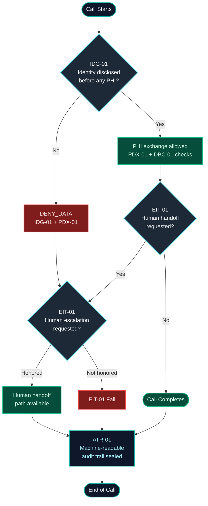

# NHID-Clinical

<p align="center">
  <picture>
    <source media="(prefers-color-scheme: dark)" srcset="assets/brand/logo-lockup-dark.svg">
    <source media="(prefers-color-scheme: light)" srcset="assets/brand/logo-lockup.svg">
    
  </picture>
</p>

<p align="center">
  <b>An operational AI-governance framework for disclosed non-human actors operating under delegated authority in healthcare interactions.</b><br>
  NHID-Clinical does not govern the AI model. It governs the identity, disclosure, authorization, and auditability of AI-operated interactions across organizational boundaries.
</p>

<p align="center">
  Built from direct payer operations experience — the <strong>impersonation latency</strong> problem, seen firsthand on live eligibility, claims, and prior-authorization lines.<br>
  <strong>Not a standard. Not a certification. Not a product.</strong> An open, testable reference for the ecosystem.
</p>

<p align="center">
  <a href="https://nhid-clinical.org"><strong>Website</strong></a> ·
  <a href="https://nhid-clinical.org/simulator.html">Simulator</a> ·
  <a href="https://nhid-clinical.org/specification.html">Specification</a> ·
  <a href="https://nhid-clinical.org/roadmap.html">v2 Identity</a> ·
  <a href="https://github.com/NHID-Clinical/NHID-Clinical/discussions">Discussions</a>
</p>

<p align="center">
  <a href="https://github.com/NHID-Clinical/NHID-Clinical/actions"></a>
  
  
  
  
  <a href="https://www.regulations.gov/comment/NIST-2025-0035-0026"></a>
</p>

<p align="center">
  <sub>The NIST badge links to a public comment submitted to a NIST RFI docket — not a NIST endorsement, adoption, or certification.</sub>
</p>

---

**Designed to support the transparency obligations described in EU AI Act Article 50; mapped to NIST AI RMF 1.0.**

NHID-Clinical targets one specific failure: an AI voice agent begins operating and requesting sensitive information **before the receiving party can verify it is non-human and properly authorized**. That window is **impersonation latency** — and in payer–provider calls it routinely covers member IDs, NPIs, dates of birth, and claim data. It delivers five concrete, testable controls, a per-call Call Authorization Score (CAS), and an optional cryptographic layer (NHID-Auth v2) for proving delegated authority. It does **not** address fairness, clinical safety, or model quality — [those stay separate by design](docs/scope-boundary-fairness-clinical.md).

## What NHID-Clinical is / is not

**Is** — an operational AI-governance framework with two layers:

- a **governance / accountability layer** — AI-caller disclosure (IDG-01, DBC-01), no-data-before-disclosure sequencing (PDX-01), human escalation (EIT-01), and machine-readable audit (ATR-01), evaluated by a deterministic conformance test suite; and
- a **non-human-actor identity and delegated-authorization layer** — NHID-Auth v2: NPI-anchored, scoped, revocable delegation with per-call binding (reference design).

**Is not** — it does **not** govern the AI model (accuracy, bias, drift, clinical safety, output quality — [out of scope by design](docs/scope-boundary-fairness-clinical.md)). It is **not** a universal AI-identity system, an autonomous-agent framework, an accredited standard, or a certification.

See [docs/positioning.md](docs/positioning.md) for the full category thesis, [docs/terminology.md](docs/terminology.md) for controlled vocabulary, and [docs/claim-boundaries.md](docs/claim-boundaries.md) for what may and may not be claimed.

## Composes with — does not replace

NHID-Clinical sits beside the healthcare and identity stack; it replaces none of it:

- **FHIR / SMART on FHIR** — audit substrate. NHID-Clinical emits FHIR R4 `AuditEvent`; FHIR carries the data, NHID-Clinical governs the AI actor exchanging or requesting it.
- **OAuth 2.x / OIDC** — transport/client authorization ("may this client call this API"); NHID-Auth authorizes the specific interaction ("was this call delegated, in this scope"). Two separate checks; neither substitutes for the other.
- **IAM platforms** — govern actors *you* provision; NHID-Clinical governs a *counterparty's* agent you never provisioned, arriving with no login step.
- **AI governance frameworks** (NIST AI RMF, ISO/IEC 42001) — meta-frameworks NHID-Clinical maps to as evidence targets, not competitors.

NHID-Clinical evaluates declared identity, authorization context, and interaction policy; it does **not** replace an underlying identity provider or cryptographic identity infrastructure.

**Healthcare differentiation** — three load-bearing design choices: **NPI-anchored delegation** (the provider's NPI is the delegation trust root), **FHIR-compatible audit evidence**, and a **risk model validated against payer–provider operational workflows**.

The governance gap is well documented; large-scale production evidence is still limited. The strongest next step for most organizations is a focused shadow pilot on their own traffic — the [**Tier 0 Shadow Pilot Kit**](docs/pilot-kit/README.md) makes that a 2–4 week exercise.

For a one-page overview aimed at hospital, payer, compliance, and procurement leaders, see the [**Executive Brief**](docs/executive-brief.md).

**Standards alignment (mapped, not certified):** Explicitly supports EU AI Act Article 50 transparency obligations for AI systems interacting with humans. Mapped to NIST AI RMF 1.0 Map and Measure functions for identity disclosure and risk. Aligns with ISO/IEC 42001 Annex A controls on system transparency and auditability.

<p align="center">
  
  <br>
  <sub><em>Clean vector visualization of the trust verification pathway — conceptual, not a product diagram.</em></sub>
</p>

## Status

An honest maturity snapshot. NHID-Clinical is a working reference implementation, not a production-scale product.

**Available today**
- Deterministic policy engine with 343 passing tests
- Live v1.3 conformance API — demo and vendor routes need no key; VAPI and Twilio adapters accept native call payloads
- Tier 0 [Shadow Pilot Kit](docs/pilot-kit/README.md) — measure impersonation latency on your own call logs in 2–4 weeks
- Conformance Test Suite and a per-call Call Authorization Score (CAS)
- NHID-Auth v2 cryptographic authorization layer, published as public reference code

**In progress**
- First shadow-evaluation partners (observe-only, no vendor changes)
- Raster brand assets and expanded interoperability adapters

**Not yet**
- Production-scale deployments
- A certification, accreditation, or standard
- Any regulatory endorsement

This is a voluntary framework — **not an accredited standard, certification, or regulatory requirement.**

## The Four Core Controls (v1.3)

| Control | Name | Requirement |
| :--- | :--- | :--- |
| **IDG-01** | Identity Disclosure Gate | Disclose non-human identity **before** any PHI exchange |
| **PDX-01** | Pre-Data Exchange Gate | No protected data until identity is disclosed |
| **DBC-01** | Deceptive Behavior Check | No synthetic human-presence artifacts (e.g. fake breathing/hesitation) or explicit human-status claims |
| **EIT-01** | Escalation Implementation Test | Clear human handoff path, honored on request |

Plus **ATR-01** (audit trail) — every call must produce a machine-readable trace.  
18-case CTS suite · same inputs → identical output · **343** Python tests passing (+ 66 TypeScript middleware tests)

[**Try the Governance Simulator →**](https://nhid-clinical.org/simulator.html)

## Five-Layer Trust Stack

<p align="center">
  

</p>

| Layer | Standard | Role |
| :--- | :--- | :--- |
| **0** | NPI Gap | The problem — no cross-org NPI authorization for AI agents |
| **1** | STIR/SHAKEN (RFC 8224) | Carrier number authentication |
| **2** | **NHID-Clinical v1.3** | Behavioral disclosure baseline — 4 controls + ATR-01 |
| **3** | NHID-Auth v2 | Cryptographic authorization — reference implementation live |
| **4** | FHIR AuditEvent R4 (base spec) | Healthcare-native audit logging |
| **5** | OpenTelemetry | Enterprise observability export |

[Full technical architecture →](https://nhid-clinical.org/technical-stack.html)

## The Impersonation Latency Problem

<p align="center">
  

  <br>
  <sub><em>Without a baseline: disclosure after PHI moves, no audit trail. With v1.3: early disclosure, verification checkpoint, human escalation, sealed audit.</em></sub>
</p>

## Conformance Flow

How the controls play out on a real call — the same sequence the CTS suite and live adapters evaluate.


```mermaid
flowchart TD
    Start(["Call Starts"]) --> Disclosure{"IDG-01<br/>Identity disclosed<br/>before any PHI?"}
    
    Disclosure -->|No| Deny["DENY_DATA<br/>IDG-01 + PDX-01"]
    Deny --> Escalate{"EIT-01<br/>Human escalation<br/>requested?"}
    
    Disclosure -->|Yes| PHI["PHI exchange allowed<br/>PDX-01 + DBC-01 checks"]
    PHI --> HumanCheck{"EIT-01<br/>Human handoff<br/>requested?"}
    
    HumanCheck -->|Yes| Escalate
    HumanCheck -->|No| Complete(["Call Completes"])
    
    Escalate -->|Honored| Handoff["Human handoff<br/>path available"]
    Escalate -->|Not honored| FailEsc["EIT-01 Fail"]
    
    Handoff --> Audit
    FailEsc --> Audit
    Complete --> Audit["ATR-01<br/>Machine-readable<br/>audit trail sealed"]
    
    Audit --> End(["End of Call"])

    classDef start fill:#0F172A,stroke:#14B8A6,stroke-width:2px,color:#F1F5F9
    classDef decision fill:#1E2937,stroke:#67E8F9,stroke-width:2px,color:#F1F5F9
    classDef deny fill:#7F1D1D,stroke:#EF4444,stroke-width:2px,color:#FEE2E2
    classDef ok fill:#064E3B,stroke:#10B981,stroke-width:2px,color:#D1FAE5
    classDef audit fill:#0F172A,stroke:#14B8A6,stroke-width:2px,color:#A5F3FC

    class Start,End start
    class Disclosure,Escalate,HumanCheck decision
    class Deny,FailEsc deny
    class PHI,Handoff,Complete ok
    class Audit audit
```

## Sequence of Interaction (Disclosure Gate)

<p align="center">
  
</p>

## Live API — Try It Now

No signup or API key required for demo and vendor adapter routes.

```bash
curl -s -X POST https://gfvq4swdtf.execute-api.us-east-1.amazonaws.com/prod/v1/adapters/vapi/check \
  -H "Content-Type: application/json" \
  -d @tests/demo_scenarios/vapi_noncompliant.json | python -m json.tool
```

<details>
<summary><b>Full endpoint reference</b></summary>

| Endpoint | Auth | Purpose |
| :--- | :--- | :--- |
| `POST /v1/demo/check` | none | Raw NHID event → conformance result |
| `POST /v1/adapters/vapi/check` | none | Native VAPI payload → result |
| `POST /v1/adapters/twilio/check` | none | Native Twilio payload → result |
| `POST /v1/adapters/vonage/check` | none | Native Vonage payload → result |
| `POST /v1/adapters/retell/check` | none | Native Retell AI payload → result |
| `POST /v1/adapters/connect/check` | none | Amazon Connect → result |
| `POST /v1/webhooks/call-progress` | none | Turn-by-turn in-call evaluation |
| `GET /v1/public/vendor/{id}/badge` | none | Public CAS badge SVG |
| `POST /v1/cts/evaluate` | none | Run CTS YAML suite |
| `POST /v1/conformance/check` | `x-api-key` | Production conformance check |

</details>

**New here?** [5-minute quickstart](docs/5-minute-quickstart.md) · [v2 integration guide](docs/v2-integration-guide.md) (Tier 0 → Tier 2)

## Quick Start

```bash
git clone https://github.com/NHID-Clinical/NHID-Clinical.git
cd NHID-Clinical
pip install -r requirements.txt
python -m pytest tests/ -v
```

Expected: **343 passing** in ~1.4s (~18 skip without a running server). Live demos and full docs on [nhid-clinical.org](https://nhid-clinical.org).

<details>
<summary><b>Repository structure</b></summary>

```
NHID-Clinical/
├── schema/          # Event schema (JSON Schema Draft 2020-12)
├── src/             # Policy engine + NHID-Auth v2 non-human-actor identity/delegation layer
├── tests/           # CTS (YAML) + pytest harness + demo scenarios
├── traces/          # 10 canonical failure traces
├── adapters/        # VAPI, Twilio, Vonage, Retell, Amazon Connect
├── functions/       # AWS Lambda handler
├── docs/            # Quickstart, integration guides, knowledge archive
└── specs/           # PDF artifacts (Overview, Core Spec, Blueprint)
```

</details>

<details>
<summary><b>Regulatory alignment (summary)</b></summary>

| Driver | Requirement | NHID-Clinical Control |
| :--- | :--- | :--- |
| CMS-0057-F | FHIR API, audit retention | FHIR AuditEvent + ATR-01 |
| MACPAC 2026 | AI transparency, human review | EIT-01 + ATR-01 |
| State AI laws | Auditable AI decisions | IDG-01 + DBC-01 |
| NIST CAISI RFI | Cross-org agent identity | NHID-Auth v2 |
| EU AI Act Art. 50 | Transparency for AI interacting with humans | IDG-01 + DBC-01 |
| ISO/IEC 42001 | AI management system transparency controls | Full control set + ATR-01 |
| NIST AI RMF 1.0 | Map & Measure functions for identity risk | Full framework + CAS |

[Full matrix →](https://nhid-clinical.org/regulatory-alignment.html)

</details>

## NHID-Auth v2

v1.3 verifies disclosure behavior. v2 verifies authorization: Ed25519 agent passports, NPI binding, scoped delegation (max 3 hops), revocation, and call-SID nonce binding. Reference code in `src/agent_identity.py`.

```bash
python -m pytest tests/test_identity.py -v
python examples/issue_and_verify.py
```

[Details →](https://nhid-clinical.org/roadmap.html)

## Repository layout

| Path | What's there |
| :-- | :-- |
| `*.html` (root) | The public website, served by GitHub Pages — `index.html` plus the section pages (about, specification, for-payers, and so on). |
| `nhid_*.py`, `app.py`, `main.py`, `llm.py` (root) | Reference implementation: the deterministic policy engine, conformance API, event store, and call handling. |
| `src/` | Packaged Python modules used by the engine and tests (e.g. agent identity). |
| `adapters/` | Vendor call-payload adapters (VAPI, Twilio). |
| `middleware/` | TypeScript middleware and its test suite. |
| `tests/` | The Python conformance and invariant tests (343 passing). |
| `scripts/` | CI guards — `validate_ci.py`, `check_baseline.py`, `check_number_drift.py` — and tooling. |
| `schema/` | Event and audit-trace schemas. |
| `docs/` | Specification docs, the [Executive Brief](docs/executive-brief.md), the [Tier 0 Shadow Pilot Kit](docs/pilot-kit/README.md), and the knowledge archive. |
| `assets/` | Brand SVGs, diagrams, images, and site CSS. |

## Contributing & Pilot Partners

We are seeking the first **shadow evaluation partners** — 90 days, observe-only, no vendor changes required. Start small: the [Tier 0 Shadow Pilot Kit](docs/pilot-kit/README.md) produces usable impersonation-latency and CAS data from your own call logs in 2–4 weeks.

[**For Payers →**](https://nhid-clinical.org/for-payers.html) · [GitHub Discussions](https://github.com/NHID-Clinical/NHID-Clinical/discussions) · [contact@nhid-clinical.org](mailto:contact@nhid-clinical.org)

---

<div align="center">
  <sub>CC BY 4.0 · Brianna Baynard · NIST-2025-0035-0026 · <a href="https://nhid-clinical.org">nhid-clinical.org</a></sub>
</div>
