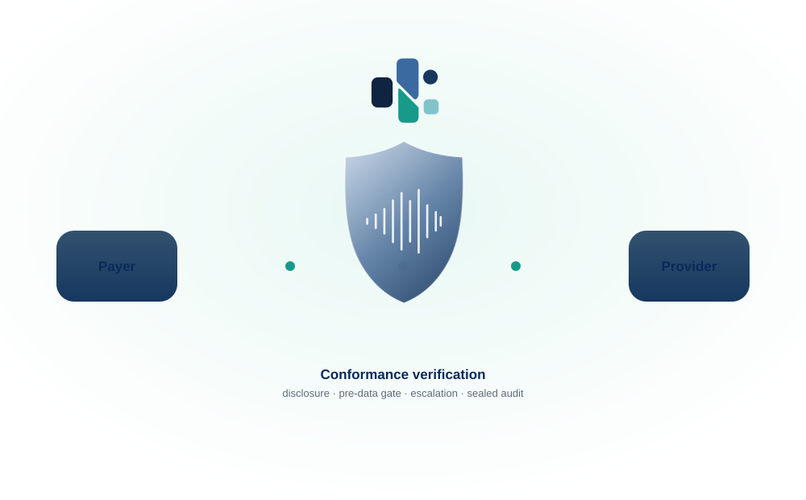
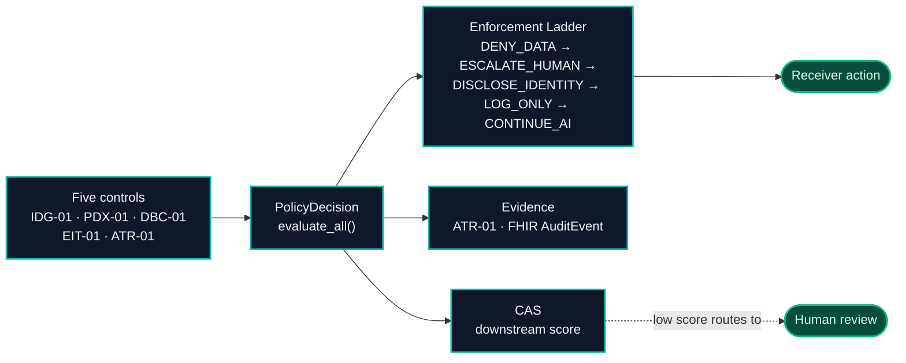
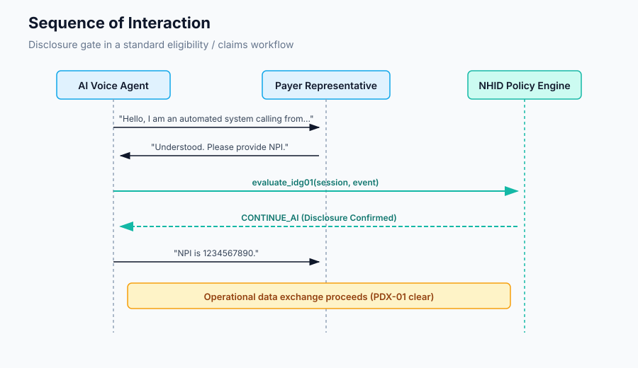

# NHID-Clinical

<p align="center">
  <picture>
    <source media="(prefers-color-scheme: dark)" srcset="assets/brand/logo-lockup-dark.svg">
    <source media="(prefers-color-scheme: light)" srcset="assets/brand/logo-lockup.svg">
    
  </picture>
</p>

<p align="center">
  <b>NHID-Clinical is an open policy-and-evidence layer for healthcare administrative AI voice interactions.</b><br>
  It records which agent acted, under whose delegated authority, within what scope, whether it disclosed
  itself before requesting protected data, whether escalation was honored, and what auditable evidence
  remains — deterministically, and in a form the receiving organization can verify without trusting the
  caller. It governs conduct at the interaction boundary, not the AI model itself.
</p>

<p align="center">
  <sub>
    The engine evaluates observable conduct and does not care who runs it. A payer or provider can run it
    <b>receiver-side</b> on inbound calls; a voice-AI vendor can run it <b>sender-side</b> in their own call
    path to produce evidence for their customers. Both use the same controls and the same artifacts.
    Sender-side operation is supported by the engine, the adapters and the evidence export today; it is
    not a packaged product, and no vendor has deployed it.
  </sub>
</p>

<p align="center">
  Built from direct payer operations experience — the <strong>impersonation latency</strong> problem, seen firsthand on live eligibility, claims, and prior-authorization lines.<br>
  <strong>Not a standard. Not a certification. Not a product.</strong> An open, testable reference for the ecosystem.
</p>

<p align="center">
  <a href="https://nhid-clinical.org"><strong>Website</strong></a> ·
  <a href="https://nhid-clinical.org/simulator.html">Simulator</a> ·
  <a href="https://nhid-clinical.org/specification.html">Specification</a> ·
  <a href="https://nhid-clinical.org/roadmap.html">v2 Identity</a> ·
  <a href="https://github.com/NHID-Clinical/NHID-Clinical/discussions">Discussions</a>
</p>

<p align="center">
  <a href="https://github.com/NHID-Clinical/NHID-Clinical/actions"></a>
  
  
  
  
  <a href="https://www.regulations.gov/comment/NIST-2025-0035-0026"></a>
</p>

<p align="center">
  <sub>The NIST badge links to a public comment submitted to a NIST RFI docket — not a NIST endorsement, adoption, or certification.</sub>
</p>

---

**Designed to support the transparency obligations described in EU AI Act Article 50; mapped to NIST AI RMF 1.0.**

NHID-Clinical targets one specific failure: an AI voice agent begins operating and requesting sensitive information **before the receiving party can verify it is non-human and properly authorized**. That window is **impersonation latency** — and in payer–provider calls it routinely covers member IDs, NPIs, dates of birth, and claim data. It delivers five concrete, testable controls, an optional delegated-authority gate (DLG-01) that verifies a cryptographically signed, scoped delegation and constrains what protected data an agent may request, and machine-readable audit evidence for what happened. It does **not** address fairness, clinical safety, or model quality — [those stay separate by design](docs/scope-boundary-fairness-clinical.md).

## Start here

**Who it's for:** security reviewers · healthcare compliance teams · AI voice vendors · payer / provider pilot teams.

Pick your path — each is runnable today:

**🔍 Reviewers & security teams** — read the boundaries, then run the tests.
1. Skim [what it is / is not](#what-nhid-clinical-is--is-not) and the [claim boundaries](docs/claim-boundaries.md)
2. `pip install -r requirements.txt && python -m pytest tests/ -v` → **779 passing** (+ 18 skipped)
3. Inspect the five controls in [`src/nhid_policy_engine_v1.py`](src/nhid_policy_engine_v1.py) and the [Enforcement Profile](docs/enforcement-profile.md)
4. Read the [Conformance Test Suite](conformance/nhid_conformance_test_suite_v1.yaml) — each case asserts an expected policy action

**🛠 AI voice vendors** — see the controls fire, then find your integration points.
1. Run the [Governance Simulator](https://nhid-clinical.org/simulator.html)
2. Send a native call payload to a demo adapter — no key required (see [Live API](#live-api--try-it-now))
3. Map your call flow to the controls via the [Developer guide](https://nhid-clinical.org/developers.html)

**🏥 Payers & providers** — review the controls, then scope a shadow pilot.
1. Read [the controls](#the-four-core-controls-v13) and the [For Payers](https://nhid-clinical.org/for-payers.html) framing
2. Pick one workflow (eligibility, claim status, prior auth)
3. Run the [Tier 0 Shadow Pilot Kit](docs/pilot-kit/README.md) on your own logs — observe-only, 2–4 weeks

## What NHID-Clinical is / is not

**Is** — an operational AI-governance framework with two layers:

- a **governance / accountability layer** — AI-caller disclosure (IDG-01, DBC-01), no-data-before-disclosure sequencing (PDX-01), human escalation (EIT-01), and machine-readable audit (ATR-01), evaluated by a deterministic conformance test suite; and
- a **non-human-actor identity and delegated-authorization layer** — NHID-Auth v2: NPI-anchored, scoped, revocable delegation with per-call binding (reference design).

**Is not** — it does **not** govern the AI model (accuracy, bias, drift, clinical safety, output quality — [out of scope by design](docs/scope-boundary-fairness-clinical.md)). It is **not** a universal AI-identity system, an autonomous-agent framework, an accredited standard, or a certification.

See [docs/positioning.md](docs/positioning.md) for the full category thesis, [docs/terminology.md](docs/terminology.md) for controlled vocabulary, and [docs/claim-boundaries.md](docs/claim-boundaries.md) for what may and may not be claimed.

## Composes with — does not replace

NHID-Clinical sits beside the healthcare and identity stack; it replaces none of it:

- **FHIR / SMART on FHIR** — audit substrate. NHID-Clinical emits FHIR R4 `AuditEvent`; FHIR carries the data, NHID-Clinical governs the AI actor exchanging or requesting it.
- **OAuth 2.x / OIDC** — transport/client authorization ("may this client call this API"); NHID-Auth authorizes the specific interaction ("was this call delegated, in this scope"). Two separate checks; neither substitutes for the other.
- **IAM platforms** — govern actors *you* provision; NHID-Clinical governs a *counterparty's* agent you never provisioned, arriving with no login step.
- **AI governance frameworks** (NIST AI RMF, ISO/IEC 42001) — meta-frameworks NHID-Clinical maps to as evidence targets, not competitors.

NHID-Clinical evaluates declared identity, authorization context, and interaction policy; it does **not** replace an underlying identity provider or cryptographic identity infrastructure.

**Healthcare differentiation** — three load-bearing design choices: **NPI-anchored delegation** (the provider's NPI is the delegation trust root), **FHIR-compatible audit evidence**, and a **risk model validated against payer–provider operational workflows**.

The governance gap is well documented; large-scale production evidence is still limited. The strongest next step for most organizations is a focused shadow pilot on their own traffic — the [**Tier 0 Shadow Pilot Kit**](docs/pilot-kit/README.md) makes that a 2–4 week exercise.

For a one-page overview aimed at hospital, payer, compliance, and procurement leaders, see the [**Executive Brief**](docs/executive-brief.md).

**Standards alignment (mapped, not certified):** Explicitly supports EU AI Act Article 50 transparency obligations for AI systems interacting with humans. Mapped to NIST AI RMF 1.0 Map and Measure functions for identity disclosure and risk. Aligns with ISO/IEC 42001 Annex A controls on system transparency and auditability.

<p align="center">
  
  <br>
  <sub><em>Clean vector visualization of the trust verification pathway — conceptual, not a product diagram.</em></sub>
</p>

## Status

An honest maturity snapshot. NHID-Clinical is a working reference implementation, not a production-scale product.

**Available today**
- Deterministic policy engine with 797 tests (779 passing) across all phases
- Live v1.3 conformance API — demo and vendor routes need no key; VAPI and Twilio adapters accept native call payloads
- Tier 0 [Shadow Pilot Kit](docs/pilot-kit/README.md) — measure impersonation latency on your own call logs in 2–4 weeks
- Conformance Test Suite, plus an evidence pack export a vendor can hand to a reviewer
- Documented **[Enforcement Profile](docs/enforcement-profile.md)** — how each control's `PolicyDecision` maps to a receiver action (a documented layer over the five controls, **not a sixth control**)
- NHID-Auth v2 cryptographic authorization layer, published as public reference code

**In progress**
- First shadow-evaluation partners (observe-only, no vendor changes)
- Raster brand assets and expanded interoperability adapters

**Not yet**
- Production-scale deployments (see [Phase 5 findings](#phase-5--architecture-review-findings) below)
- A certification, accreditation, or standard
- Any regulatory endorsement

This is a voluntary framework — **not an accredited standard, certification, or regulatory requirement.**

## Phase 5 & Architecture Review Findings

**Date**: July 30, 2026 | **Status**: Reference implementation validated; production readiness assessment complete

### Validation Results

Phase 5 targeted-edge-case testing (15 healthcare scenarios) confirmed heuristic boundaries of the v1.3 engine:

| Control | Detection Rate | Status | Finding |
|---------|---|---|---|
| **IDG-01** (identity disclosure) | 87.5% baseline → 20% on vague disclosures | ⚠️ Acceptable for v1.3 | Engine validates presence not quality; "authorization system" passes as valid disclosure. Semantic validation deferred to Phase 2. |
| **PDX-01** (PHI timing) | 100% (within scope) | ✅ Solid | Timing gate working correctly. v1.3 design intentionally excludes turn-0 post-disclosure probes. |
| **DBC-01** (deception detection) | 80% baseline → 40% on subtle patterns | ⚠️ Heuristic ceiling | Keyword-only heuristics catch explicit role claims ("specialist") but miss pragmatic contradictions (promise→deflect) and implicit patterns (deliberate pauses). Multi-turn analysis deferred to Phase 2. |
| **EIT-01** (escalation path) | 100% | ✅ Solid | Phase 4 engine fix stable; escalation outcome checks fire independent of current-turn speech. |

**Conclusion**: v1.3 engine is **internally consistent and deterministic**. Baseline capabilities (IDG-01 presence, PDX-01 timing, EIT-01 escalation) are production-ready. DBC-01 and IDG-01 quality gaps are documented and scoped to Phase 2 ML/NLP enhancement.

### Production Readiness Assessment

**Current maturity level**: Internal Tool / Proof of Concept with Live Infrastructure  
**Not yet**: Limited Pilot (operational readiness required)

**Critical gaps blocking release** (4–6 weeks remediation required):
1. 🔒 **Security assessment** — Input validation, encryption, attack surface untested
2. ⏱️ **Load testing** — Scalability and latency under concurrent requests unknown
3. 👁️ **Monitoring & observability** — Production visibility, alerting, incident runbook missing
4. 🏥 **HIPAA compliance** — Business Associate Agreement, Data Processing Agreement not drafted
5. 📋 **Audit trail specification** — Format, retention, immutability, access control undefined
6. 🔑 **Authentication & authorization** — API key rotation, rate limiting, per-customer isolation untested

**Known limitations (documented)**: DBC-01 @ 40% on subtle deception, IDG-01 @ 20% on vague disclosure. Both deferred to Phase 2 ML/NLP work. IDG-01 and PDX-01 baseline (presence + timing gate) remain stable and suitable for pilot.

**Recommendation**: Do not release to GA. Proceed to limited pilot (2–3 customers, 4 weeks) only after addressing critical gaps and obtaining legal/compliance sign-off. See the [**Enforcement Profile**](docs/enforcement-profile.md) for detailed control decision criteria and receiver actions.

**Timeline to production**: 12–14 weeks (remediation → pilot → post-pilot review → GA), not immediate.

See **[NHID Audit Event Spec](docs/NHID_AUDIT_EVENT_SPEC_v1.0.md)** and **[Metrics & Observability](docs/NHID_METRICS_AND_OBSERVABILITY_v1.md)** for full technical specifications.

---

## Phase 6: Evidence Hardening Sprint (Complete)

**Date**: July 30, 2026 | **Status**: Evidence package complete (2–3 week sprint, ~57 hours)

### Deliverables

Instead of 4–6 week enterprise hardening, Phase 6 focused on credibility evidence for pilot evaluation and portfolio demonstration:

| Item | Deliverable | Status | Purpose |
|------|---|---|---|
| **1** | **Governance Evaluation Corpus v1.0** | ✅ Complete | 25 healthcare scenarios (5 compliant + 10 single-rule + 10 multi-rule) with 100+ turns; demonstrates rule-combination coverage |
| **2** | **Detection Rate Report** | ✅ Complete | 81.2% aggregate detection (26/32 violations); 0% false-positive rate; per-rule accuracy breakdown |
| **3** | **NHID Audit Event Spec v1.0** | ✅ Complete | Formal audit trail schema, immutability requirements (append-only + hash chain options), 7-year retention, compliance mappings (HIPAA §164.312b) |
| **4** | **Metrics & Observability v1.0** | ✅ Complete | 6 metric categories, CloudWatch integration, pilot dashboard layout, alert thresholds, weekly reporting template |
| **5** | **Architecture Overview (Pilot-Ready)** | ✅ Complete | 10-minute executive brief for security architects; governance statement for portfolio; pilot success criteria and go/no-go recommendation |

### Evidence Summary

**Engine Validation**:
- ✅ **779 passing tests** (797 total; comprehensive rule coverage across all phases)
- ✅ **25-scenario evaluation corpus** (81.2% detection, 0% false positives)
- ✅ **Live endpoint tested** against noncompliant VAPI payload
- ✅ **Deterministic** — same input always produces same output

**Governance Readiness**:
- ✅ **Strong rules**: DBC-01 (100%), EIT-01 (100%)
- ✅ **Acceptable rules**: IDG-01 (71.4%), PDX-01 (66.7%) — edge cases documented
- ✅ **Audit trail spec**: Format, retention, immutability, HIPAA compliance complete
- ✅ **Monitoring spec**: Pilot dashboard, alert thresholds, weekly reporting

**Portfolio Positioning**:
- ✅ **Not an enterprise product**: Minimal surrounding infrastructure
- ✅ **Production-validated engine**: Deterministic policy enforcement battle-tested
- ✅ **Pilot-ready**: Suitable for 2–3 customer evaluation (4 weeks)
- ✅ **Evidence-backed**: Test results, corpus, detection rates, governance statement

### Artifacts

- [`tests/evaluation_corpus_v1.json`](tests/evaluation_corpus_v1.json) — 25 scenarios, 99 turns
- See **[Corpus Evaluation Summary](docs/CORPUS_EVALUATION_SUMMARY.md)** for detection rates and analysis
- [`docs/NHID_AUDIT_EVENT_SPEC_v1.0.md`](docs/NHID_AUDIT_EVENT_SPEC_v1.0.md) — Formal spec (schema, retention, compliance)
- [`docs/NHID_METRICS_AND_OBSERVABILITY_v1.md`](docs/NHID_METRICS_AND_OBSERVABILITY_v1.md) — Pilot monitoring & alerting

### Next Steps

**v1.1 Engine**: ✅ **Frozen** — no further policy engine changes planned  
**v1.2 Infrastructure** (Phase 2, if pilot opportunity appears):
- Implement ATR-01 (audit trail enforcement)
- Add NLP semantic scoring for IDG-01/DBC-01
- Enterprise monitoring + SLA + HIPAA BAA signing

**v2.0 Identity Layer**: NHID-Auth v2 (reference code in `src/agent_identity.py`, 60+ passing tests)

## The Four Core Controls (v1.3)

| Control | Name | Requirement |
| :--- | :--- | :--- |
| **IDG-01** | Identity Disclosure Gate | Disclose non-human identity **before** any PHI exchange |
| **PDX-01** | Pre-Data Exchange Gate | No protected data until identity is disclosed |
| **DBC-01** | Deceptive Behavior Check | No synthetic human-presence artifacts (e.g. fake breathing/hesitation) or explicit human-status claims |
| **EIT-01** | Escalation Implementation Test | Clear human handoff path, honored on request |

Plus **ATR-01** (audit trail) — every call must produce a machine-readable trace.  
Comprehensive test suite · same inputs → identical output · **779 passing** + 18 skipped (797 total tests)

[**Try the Governance Simulator →**](https://nhid-clinical.org/simulator.html)

## Enforcement Profile

The controls don't just detect — they emit a **receiver action**. Each call turn evaluates to a single `PolicyDecision`, and when several controls fire at once a fixed **Enforcement Ladder** selects the most-protective action for the receiving system to execute. This is documented behavior of the deterministic engine, **not a sixth control** — full spec in [docs/enforcement-profile.md](docs/enforcement-profile.md).


```mermaid
flowchart LR
    C["Five controls<br/>IDG-01 · PDX-01 · DBC-01<br/>EIT-01 · ATR-01"] --> D["PolicyDecision<br/>evaluate_all()"]
    D --> L["Enforcement Ladder<br/>DENY_DATA → ESCALATE_HUMAN →<br/>DISCLOSE_IDENTITY → LOG_ONLY → CONTINUE_AI"]
    L --> A(["Receiver action"])
    D --> E["Evidence<br/>ATR-01 · FHIR AuditEvent"]
    D --> CAS["CAS<br/>downstream score"]
    CAS -. low score routes to .-> HR(["Human review"])

    classDef box fill:#0F172A,stroke:#14B8A6,stroke-width:2px,color:#F1F5F9
    classDef acc fill:#064E3B,stroke:#10B981,stroke-width:2px,color:#D1FAE5
    class C,D,L,E,CAS box
    class A,HR acc
```

<sub>Precedence: `DENY_DATA > ESCALATE_HUMAN > DISCLOSE_IDENTITY > LOG_ONLY > CONTINUE_AI`. CAS is a **research component**, not part of the product surface: nothing in this repository produces its inputs, and it never overrides the `PolicyDecision` — `evaluate_all()` structurally cannot read it. See `src/nhid_cas.py`.</sub>

## Five-Layer Trust Stack

<p align="center">
  

</p>

| Layer | Standard | Role |
| :--- | :--- | :--- |
| **0** | NPI Gap | The problem — no cross-org NPI authorization for AI agents |
| **1** | STIR/SHAKEN (RFC 8224) | Carrier number authentication |
| **2** | **NHID-Clinical v1.3** | Behavioral disclosure baseline — 4 controls + ATR-01 |
| **3** | NHID-Auth v2 | Cryptographic authorization — reference implementation live |
| **4** | FHIR AuditEvent R4 (base spec) | Healthcare-native audit logging |
| **5** | OpenTelemetry | Enterprise observability export |

[Full technical architecture →](https://nhid-clinical.org/technical-stack.html)

## The Impersonation Latency Problem

<p align="center">
  

  <br>
  <sub><em>Without a baseline: disclosure after PHI moves, no audit trail. With v1.3: early disclosure, verification checkpoint, human escalation, sealed audit.</em></sub>
</p>

## Conformance Flow

How the controls play out on a real call — the same sequence the CTS suite and live adapters evaluate.


```mermaid
flowchart TD
    Start(["Call Starts"]) --> Disclosure{"IDG-01<br/>Identity disclosed<br/>before any PHI?"}
    
    Disclosure -->|No| Deny["DENY_DATA<br/>IDG-01 + PDX-01"]
    Deny --> Escalate{"EIT-01<br/>Human escalation<br/>requested?"}
    
    Disclosure -->|Yes| PHI["PHI exchange allowed<br/>PDX-01 + DBC-01 checks"]
    PHI --> HumanCheck{"EIT-01<br/>Human handoff<br/>requested?"}
    
    HumanCheck -->|Yes| Escalate
    HumanCheck -->|No| Complete(["Call Completes"])
    
    Escalate -->|Honored| Handoff["Human handoff<br/>path available"]
    Escalate -->|Not honored| FailEsc["EIT-01 Fail"]
    
    Handoff --> Audit
    FailEsc --> Audit
    Complete --> Audit["ATR-01<br/>Machine-readable<br/>audit trail sealed"]
    
    Audit --> End(["End of Call"])

    classDef start fill:#0F172A,stroke:#14B8A6,stroke-width:2px,color:#F1F5F9
    classDef decision fill:#1E2937,stroke:#67E8F9,stroke-width:2px,color:#F1F5F9
    classDef deny fill:#7F1D1D,stroke:#EF4444,stroke-width:2px,color:#FEE2E2
    classDef ok fill:#064E3B,stroke:#10B981,stroke-width:2px,color:#D1FAE5
    classDef audit fill:#0F172A,stroke:#14B8A6,stroke-width:2px,color:#A5F3FC

    class Start,End start
    class Disclosure,Escalate,HumanCheck decision
    class Deny,FailEsc deny
    class PHI,Handoff,Complete ok
    class Audit audit
```

## Sequence of Interaction (Disclosure Gate)

<p align="center">
  
</p>

## Live API — Try It Now

No signup or API key required for demo and vendor adapter routes.

```bash
curl -s -X POST https://gfvq4swdtf.execute-api.us-east-1.amazonaws.com/prod/v1/adapters/vapi/check \
  -H "Content-Type: application/json" \
  -d @tests/demo_scenarios/vapi_noncompliant.json | python -m json.tool
```

<details>
<summary><b>Full endpoint reference</b></summary>

| Endpoint | Auth | Purpose |
| :--- | :--- | :--- |
| `POST /v1/demo/check` | none | Raw NHID event → conformance result |
| `POST /v1/adapters/vapi/check` | none | Native VAPI payload → result |
| `POST /v1/adapters/twilio/check` | none | Native Twilio payload → result |
| `POST /v1/adapters/vonage/check` | none | Native Vonage payload → result |
| `POST /v1/adapters/retell/check` | none | Native Retell AI payload → result |
| `POST /v1/adapters/connect/check` | none | Amazon Connect → result |
| `POST /v1/webhooks/call-progress` | none | Turn-by-turn in-call evaluation |
| `GET /v1/public/vendor/{id}/badge` | none | Legacy CAS badge SVG. Retained for existing callers; CAS is a research component and is not part of the product surface — see `src/nhid_cas.py`. |
| `POST /v1/cts/evaluate` | none | Run CTS YAML suite |
| `POST /v1/conformance/check` | `x-api-key` | Production conformance check |

</details>

**New here?** [5-minute quickstart](docs/5-minute-quickstart.md) · [v2 integration guide](docs/v2-integration-guide.md) (Tier 0 → Tier 2)

## Quick Start

```bash
git clone https://github.com/NHID-Clinical/NHID-Clinical.git
cd NHID-Clinical
pip install -r requirements.txt
python -m pytest tests/ -v
```

Expected: **779 passing** in ~3.0s (~18 skipped integration tests; 797 total). Live demos and full docs on [nhid-clinical.org](https://nhid-clinical.org).

<details>
<summary><b>Repository structure</b></summary>

```
NHID-Clinical/
├── schema/          # Event schema (JSON Schema Draft 2020-12)
├── src/             # Policy engine + NHID-Auth v2 non-human-actor identity/delegation layer
├── tests/           # CTS (YAML) + pytest harness + demo scenarios
├── traces/          # 10 canonical failure traces
├── adapters/        # VAPI, Twilio, Vonage, Retell, Amazon Connect
├── functions/       # AWS Lambda handler
├── docs/            # Quickstart, integration guides, knowledge archive
└── specs/           # PDF artifacts (Overview, Core Spec, Blueprint)
```

</details>

<details>
<summary><b>Regulatory alignment (summary)</b></summary>

| Driver | Requirement | NHID-Clinical Control |
| :--- | :--- | :--- |
| CMS-0057-F | FHIR API, audit retention | FHIR AuditEvent + ATR-01 |
| MACPAC 2026 | AI transparency, human review | EIT-01 + ATR-01 |
| State AI laws | Auditable AI decisions | IDG-01 + DBC-01 |
| NIST CAISI RFI | Cross-org agent identity | NHID-Auth v2 |
| EU AI Act Art. 50 | Transparency for AI interacting with humans | IDG-01 + DBC-01 |
| ISO/IEC 42001 | AI management system transparency controls | Full control set + ATR-01 |
| NIST AI RMF 1.0 | Map & Measure functions for identity risk | Full framework |

[Full matrix →](https://nhid-clinical.org/regulatory-alignment.html)

</details>

## NHID-Auth v2

v1.3 verifies disclosure behavior. v2 verifies authorization: Ed25519 agent passports, NPI binding, scoped delegation (max 3 hops), revocation, and call-SID nonce binding. Reference code in `src/agent_identity.py`.

```bash
python -m pytest tests/test_identity.py -v
python examples/issue_and_verify.py
```

[Details →](https://nhid-clinical.org/roadmap.html)

## Repository layout

| Path | What's there |
| :-- | :-- |
| `*.html` (root) | The public website, served by GitHub Pages — `index.html` plus the section pages (about, specification, for-payers, and so on). |
| `nhid_*.py`, `app.py`, `main.py`, `llm.py` (root) | Reference implementation: the deterministic policy engine, conformance API, event store, and call handling. |
| `src/` | Packaged Python modules used by the engine and tests (e.g. agent identity). |
| `adapters/` | Vendor call-payload adapters (VAPI, Twilio). |
| `middleware/` | TypeScript middleware and its test suite. |
| `tests/` | The Python conformance and invariant tests (779 passing, 797 total; all phases: foundations, adversarial, synthetic, hardening). |
| `scripts/` | CI guards — `validate_ci.py`, `check_baseline.py`, `check_number_drift.py` — and tooling. |
| `schema/` | Event and audit-trace schemas. |
| `docs/` | Specification docs, the [Executive Brief](docs/executive-brief.md), the [Tier 0 Shadow Pilot Kit](docs/pilot-kit/README.md), and the knowledge archive. |
| `assets/` | Brand SVGs, diagrams, images, and site CSS. |

## Contributing & Pilot Partners

We are seeking the first **shadow evaluation partners** — 90 days, observe-only, no vendor changes required. Start small: the [Tier 0 Shadow Pilot Kit](docs/pilot-kit/README.md) produces usable impersonation-latency data from your own call logs in 2–4 weeks.

[**For Payers →**](https://nhid-clinical.org/for-payers.html) · [GitHub Discussions](https://github.com/NHID-Clinical/NHID-Clinical/discussions) · [contact@nhid-clinical.org](mailto:contact@nhid-clinical.org)

## Creator & Project Lead


**Brianna Baynard**
AI Governance & Security Researcher · AIGP · ISC² CC · WGU Cybersecurity

Creator and project lead for NHID-Clinical. Background in healthcare payer operations, identity-verification workflows, and regulated-data environments. NHID-Clinical grew out of direct experience observing operational gaps in healthcare AI voice workflows, and is maintained as an open reference implementation for technical review — feedback and criticism are welcome.

[LinkedIn](https://www.linkedin.com/in/brianna-baynard) · [GitHub](https://github.com/NHID-Clinical/NHID-Clinical) · [Project website](https://nhid-clinical.org)

<br clear="left"/>

---

<div align="center">
  <sub>CC BY 4.0 · Brianna Baynard · <a href="https://www.regulations.gov/comment/NIST-2025-0035-0026">NIST-2025-0035-0026</a> · <a href="https://nhid-clinical.org">nhid-clinical.org</a></sub>
</div>
